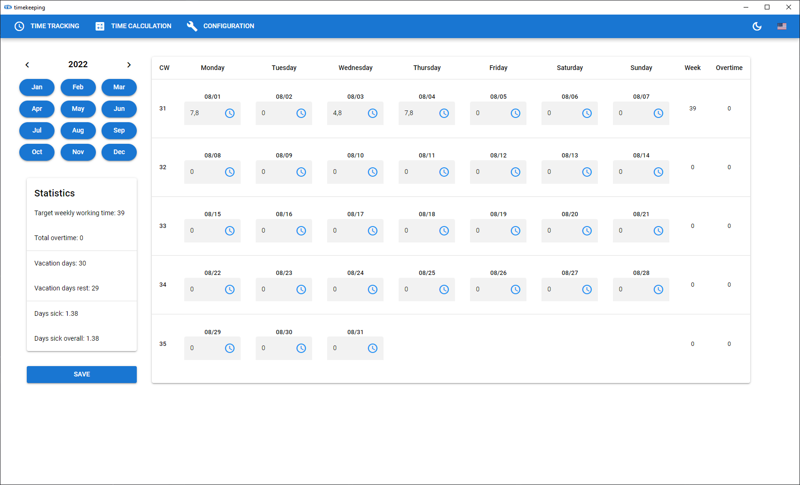
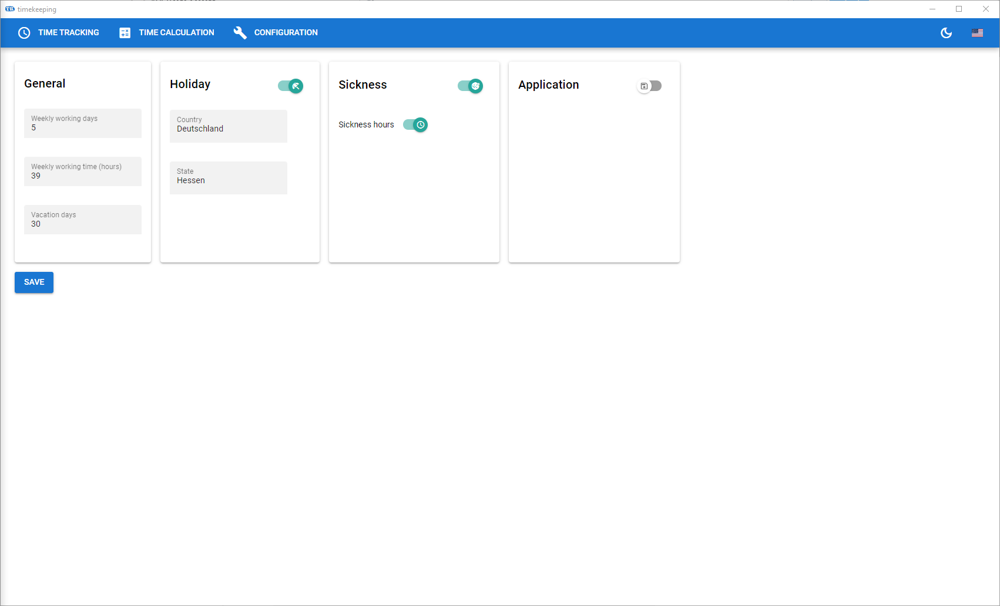
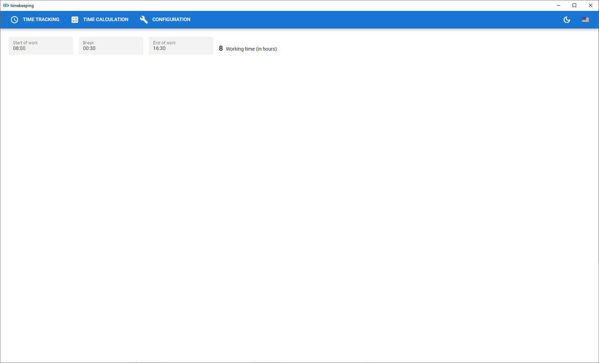

# timekeeping



This app is just a simple time keeper for work times build as an quasar tauri app. (I needed this for my current work place). The app displays the current visible month with all days and allows to input the hour you worked on that day.

## Functionality

The following sections explain, how to use and how to configure the timekeeping application.

### General

The application has three menu items, to navigate between them. The first item is the "Time Tracking" page. On this page you can keep track of your work time (see [Time Tracking](#time-tracking).) The "Time Calculator" page supports you to calculate a specific work time (see [Time Calculator](#time-calculator)). On the "Configuration" page you can configure the application to your needs (see [Configuration](#configuration)).

### Configuration



The "Configuration" page provides the following possibilties to change the behavior of the application:

* General -> General configuration properties like `weekly working days`, etc.

* Holiday -> Enable or disable displaying holidays

* Sickness -> Enable or disable sickness option

* Application -> Enable or disable auto save

Besides the configurations on the main page, there are also a theme and language switcher on the right side of the toolbar.

To save the changed configuration, you can press the `Save` button on the left hand side. (more informations under (Application)[#application])

#### General

The general section has three fields, to change the behavior of the time tracking.

* Weekly working days
  The weekly working days field defines, how much days in the week you need to work. This properties affects every calculation of the application, like overtime and etc.
  The default is set to `5`. (No weekend working for sure ;))

* Weekly working time (hours)
  Defines how much hours you need to work in the week. Affects also every calculations like overtime and so on. The default value is set to `39`

* Vacation days
  Define how much days you have free time per year. The default value is `30`.

#### Holiday

The holiday section can be used to display holidays on the "Time Tracking" page. It displays all types of holidays depedent on the chosen country and state. The holidays are separated between holidays that are handled as work time off and holidays that are only "good to know". For the work time off holidays, the fields will be disabled, because you don't need to work!

* Country
  Speficies for which country you want have the holidays around. Currently there is only Germany and US available. The default is `Deutschland`=Germany

* State
  Defines the state you want to have the holidays for. In some countries the holidays are different in the states. The field is also dependent on the country and will behave like that. The default is `Hessen`

If you don't want to have holidays around, you can turn it off with the toggle button on the right top side of the holiday section.

#### Sickness

The sickness section can be used to keep track of your working time off because of beeing sick. 

* Sickness hours
  The toggle button can be used to either interpretate the missing hours, because of sickness, as working time (true) or not (false). The default is `true`.

If you don't want to have the sickness mode around, you can turn it off with the toggle button on the right top side of the sickness section.

#### Application

The application section can be used to enable the auto save function.

* Auto. Save(Seconds)
  The count of seconds, on which the applications should save the configuration and the data. The default is `15` seconds.

If you don't want to have the auto save functionality you can turn it off with the toggle button on the top right side of the section.

The theme and the locale switcher are also considered application related configurations. But those two options are always around on the right side of the toolbar.

* Theme switcher (Moon Icon)
  You can switch between the light and dark theme. The default is `light`.

* Locale switcher (Flag)
  You can switch between german and us language. The default is `german`. 

All data is saved in different json files, located under (for windows) `C:\Users\User\AppData\Roaming\timekeeping\data`.
The `configuration.json` contains all the changed configuration data. The `data.json` contains all the input of the timekeeper.

If you want to backup your data, just simply copy the folder and save it somewhere else.

### Time Tracking

The main page of the application is located under the "Time Tracking" tab. (See screenshot below)


* Month Picker
  On the top left side you have the the month picker around. On the top of the month picker you can navigate between the years. The view will be updated. Below the year picker you have the months of the year around. When you click on a month, the Month Table on the center of the page will be updated and will be display the according days of the month.

* Statistics
  The statistics section will display some interesting informations about your time tracking.
  
  - Target weekly working time
    Just displays the configured value of `weekly working time` from the configuration general section.
  
  - Total overtime
    Displays automatically the calculated total overtime you worked.
  
  - Vacation days
    Just displays the configured value of `vacation days` from the configuration general section.
  
  - Vacation days rest
    Displays automatically the rest days, after you have booked holiday on a day field.
  
  - Days sick
    Displays the days you were sick in the current month. Will only be displayed if you have the configuration for sickness set to `true`.
  
  - Days sick overall
    Displays the days you were overall sick. Will only be displayed if you have the configuration for sickness set to `true`.

* Month Table
  
  The month table is the central UI component of the "Time Tracking" page. It displays the current calendar weeks and it's days. In the last two columns there is the total worktime and also the overtime automatically calculated.

* Day Field
  
  A day field is one field in the month table. It has three status.
  
  * Clock symbol
    
    If the clock symbol is selected, the input time is interpreted as work time.
  
  * Vacation symbol
    
    If the vacation symbol is selected, the input time is interpreted as vacation time.
  
  * Sick symbol
    
    If the configuration of sickness is allowed, then the sick symbol can be used to specify the hours of beeing sick for the specific day.

* Save
  
  The save button can be found on the bottom of the left side. It allows the user to save the current data.

### Time Calculator



If you need to calculate your working time you can use the "Time Calculator" page. There you can input your start time, your break and your end time. The calculator will show you how many hours you worked.

Currently this only uses the 24h time format.

## Dev

To start the application in browser run (will not 100% work, because no access to the native file system)

```bash
   pnpm web
```

To start the application in tauri

```bash
   pnpm dev
```

## Build

If you want to use the executable, then execute the following.

```bash
   pnpm build && pnpm build:tauri
```

After build you can either use the msi installer under `.\timekeeping\src-tauri\target\release\bundle\timekeeping_tauri_0.1.0_x64_en-US.msi` or you can use the standalone executable under `.\timekeeping\src-tauri\target\release\timekeeping_tauri.exe`.

### Github Actions
